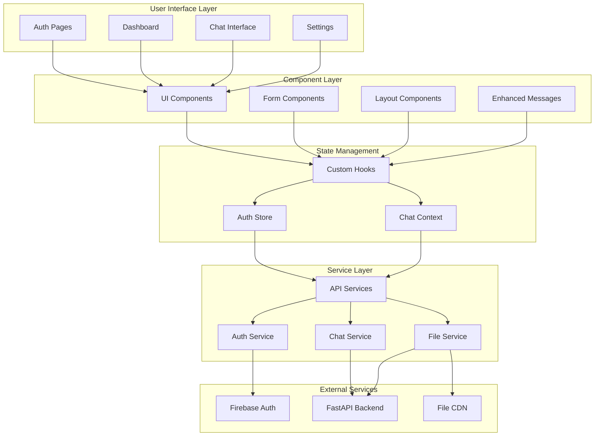

# SmartKrishi Frontend

A modern React-based frontend for the SmartKrishi AI-powered agricultural assistant with real-time chat, file upload, and advanced UI/UX features.

## 🚀 Features

- **Real-time Chat Interface**: Streaming AI responses with typing indicators
- **Modern UI Components**: Built with Radix UI and Tailwind CSS
- **File Upload & Analysis**: Drag-and-drop support for images, documents, PDFs
- **Firebase Authentication**: Secure phone-based authentication
- **Responsive Design**: Mobile-first approach with PWA capabilities
- **Advanced Chat Features**: Message editing, copying, voice input, and search
- **AI Reasoning Visualization**: Step-by-step AI thinking process display
- **Network Status Monitoring**: Offline detection and fallback handling
- **Performance Optimized**: Code splitting, lazy loading, and caching

## 🏗️ Architecture



## 📁 Project Structure

```
frontend/
├── public/                     # Static assets
│   ├── vite.svg               # App icon
│   └── farmerbackground.png   # Background images
│
├── src/
│   ├── components/             # React components
│   │   ├── ui/                # Reusable UI components
│   │   │   ├── button.tsx     # Button component
│   │   │   ├── input.tsx      # Input component
│   │   │   ├── chat-input.tsx # Chat input with voice
│   │   │   ├── enhanced-message.tsx # Rich message display
│   │   │   ├── file-upload.tsx # File upload component
│   │   │   ├── history-drawer.tsx # Chat history sidebar
│   │   │   ├── network-status.tsx # Network monitoring
│   │   │   └── reasoning-panel.tsx # AI reasoning display
│   │   │
│   │   ├── ProtectedRoutes.tsx # Route protection
│   │   └── LoadingSpinner.tsx  # Loading states
│   │
│   ├── hooks/                  # Custom React hooks
│   │   ├── useAuth.ts         # Authentication hook
│   │   ├── useStreamingChat.ts # Real-time chat hook
│   │   ├── useReasoning.ts    # AI reasoning hook
│   │   ├── useFileUpload.ts   # File upload hook
│   │   └── useAuthInit.ts     # Auth initialization
│   │
│   ├── pages/                  # Page components
│   │   ├── AuthPage.tsx       # Login/signup page
│   │   ├── DashboardPage.tsx  # Main chat interface
│   │   └── LandingPage.tsx    # Landing page (if exists)
│   │
│   ├── services/               # API service layer
│   │   ├── api.ts            # Axios configuration
│   │   ├── auth.ts           # Authentication service
│   │   ├── chatService.ts    # Chat API calls
│   │   └── fileService.ts    # File upload service
│   │
│   ├── store/                  # State management
│   │   └── authStore.ts      # Authentication state
│   │
│   ├── lib/                    # Utilities and config
│   │   ├── utils.ts          # General utilities
│   │   ├── firebase.ts       # Firebase configuration
│   │   └── constants.ts      # App constants
│   │
│   ├── styles/                 # Global styles
│   │   └── globals.css       # Global CSS
│   │
│   ├── types/                  # TypeScript definitions
│   │   ├── auth.ts           # Auth types
│   │   ├── chat.ts           # Chat types
│   │   └── api.ts            # API types
│   │
│   ├── utils/                  # Helper functions
│   │   ├── formatting.ts     # Text formatting
│   │   ├── validation.ts     # Form validation
│   │   └── constants.ts      # Constants
│   │
│   ├── App.tsx                # Main app component
│   ├── main.tsx              # App entry point
│   └── vite-env.d.ts         # Vite type definitions
│
├── index.html                  # HTML template
├── package.json               # Dependencies and scripts
├── vite.config.ts            # Vite configuration
├── tailwind.config.js        # Tailwind CSS config
├── tsconfig.json             # TypeScript configuration
└── README.md                 # This file
```

## 🛠️ Tech Stack

- **Framework**: React 19.1+ with TypeScript 5.8+
- **Build Tool**: Vite 7.1+ for fast development and building
- **Styling**: Tailwind CSS 3+ with custom design system
- **UI Components**: Radix UI primitives with custom styling
- **Authentication**: Firebase Auth with phone verification
- **HTTP Client**: Axios with interceptors and error handling
- **State Management**: React Context + Custom hooks
- **Form Handling**: React Hook Form with validation
- **Icons**: Lucide React icon library
- **Animations**: Framer Motion for smooth transitions
- **Code Highlighting**: Highlight.js for code blocks
- **Markdown**: React Markdown for rich text rendering

## 📋 Prerequisites

- **Node.js**: 18+ or 20+ (LTS recommended)
- **Package Manager**: pnpm, npm, or yarn
- **Firebase Project**: With phone authentication enabled
- **Backend API**: SmartKrishi backend running

## 🚀 Quick Start

### 1. Clone and Setup

```bash
# Clone the repository
git clone <repository-url>
cd SmartKrishi/frontend

# Install dependencies (using pnpm - recommended)
pnpm install

# Or using npm
npm install

# Or using yarn
yarn install
```

### 2. Environment Configuration

```bash
# Copy environment template
cp .env.example .env

# Edit .env with your configuration
nano .env
```

Required environment variables:
- `VITE_API_BASE_URL`: Backend API URL
- `VITE_FIREBASE_API_KEY`: Firebase API key
- `VITE_FIREBASE_AUTH_DOMAIN`: Firebase auth domain
- `VITE_FIREBASE_PROJECT_ID`: Firebase project ID
- Additional Firebase configuration values

### 3. Development Server

```bash
# Start development server
pnpm dev

# Or with npm
npm run dev

# Or with yarn
yarn dev
```

The application will be available at:
- **Development**: http://localhost:5173
- **Network**: http://[your-local-ip]:5173

### 4. Build for Production

```bash
# Build optimized production bundle
pnpm build

# Preview production build locally
pnpm preview

# Or with npm
npm run build && npm run preview
```

## 🧪 Testing

```bash
# Run unit tests (if configured)
pnpm test

# Run tests with coverage
pnpm test:coverage

# Run end-to-end tests (if configured)
pnpm test:e2e

# Type checking
pnpm type-check
```

## 🚀 Deployment

### Build Optimization

```bash
# Production build with optimizations
pnpm build

# Analyze bundle size
pnpm build --analyze

# Build with custom base path
pnpm build --base=/app/
```

### Static Hosting Deployment

**Vercel** (Recommended):

```bash
# Install Vercel CLI
npm i -g vercel

# Deploy
vercel --prod
```

**Netlify**:

```bash
# Build command: pnpm build
# Publish directory: dist

# Deploy with CLI
netlify deploy --prod --dir=dist
```

**Firebase Hosting**:

```bash
# Install Firebase CLI
npm install -g firebase-tools

# Initialize and deploy
firebase init hosting
firebase deploy
```

## 📄 License

This project is licensed under the MIT License - see the LICENSE file for details.

## 📞 Support

For support and questions:
- Create an issue on GitHub
- Check the browser console for errors
- Review the troubleshooting guide

## 🔧 Troubleshooting

### Common Issues

**Build Errors**:

```bash
# Clear node_modules and reinstall
rm -rf node_modules pnpm-lock.yaml
pnpm install

# Clear Vite cache
rm -rf node_modules/.vite
pnpm dev
```

**Firebase Authentication Issues**:
- Verify Firebase project configuration
- Check phone authentication is enabled
- Ensure correct domain configuration

**API Connection Issues**:
- Verify backend is running
- Check CORS configuration
- Validate environment variables
